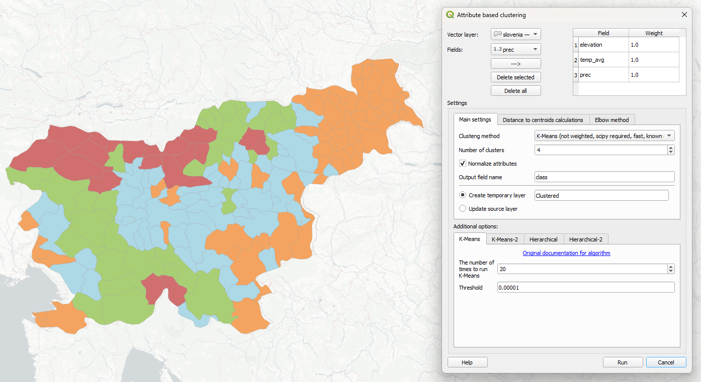
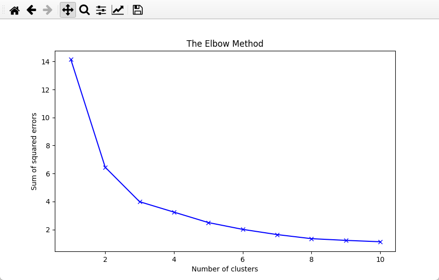
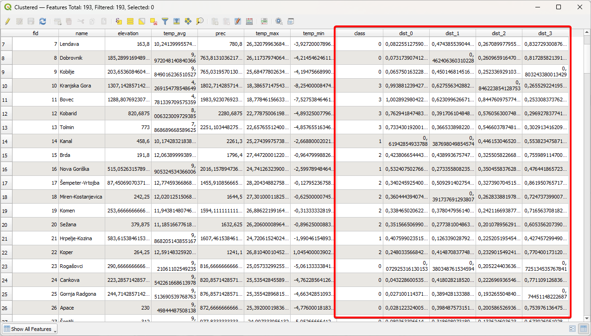

# Attribute based clustering

QGIS plugin for clustering vector data based on attributes.

## Features
* Customizable clustering with 4 methods: two variations of K-Means and two variations of Hierarchical clustering. 3 of them are for known number of clusters, and 1 for unknown
* All clustering methods are available as QGIS Processing tools and via special GUI 
* Inpit is any vector layer with one or more numeric attributes
* Output is a new attribute with relevant for object cluster number.
* Different weights for attributes available when using native hierarchical clustring method
* Ability to calculate distances from each object to centroids of each cluster and save them as attributes
* Ability to draw Elbow plot for estimating optimal number of clusters

Elbow plot:

Output attributes (cluster number and distances to cluster centroids):

## Documentation

## Installation

The plugin is available in the official QGIS Plugin Repository.

You can also install it from ZIP archive.

## Contacts

Eduard Kazakov | ee.kazakov@gmail.com

